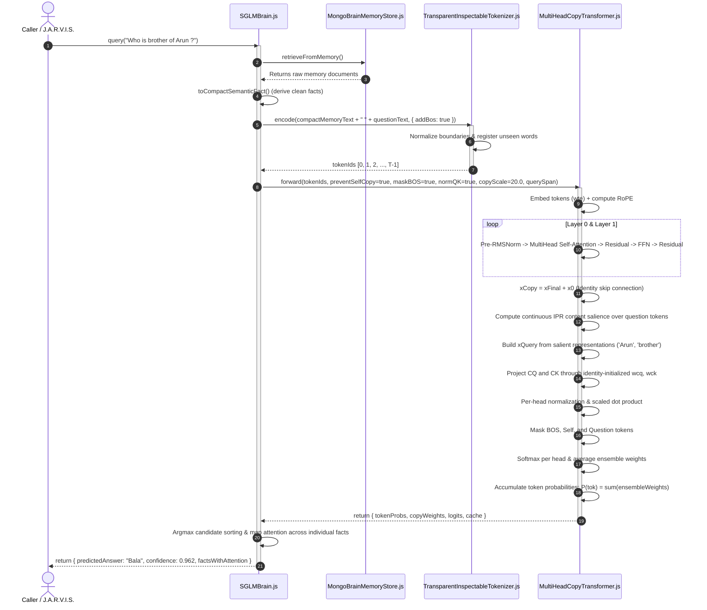

# SGLM Kernel: Query Execution Mind Map & Architectural Flow

This document provides a comprehensive mind map and architectural diagram detailing the complete lifecycle of a query through the **SGLM (Small Generative Language Model) Kernel** and **SGLMBrain**.

---

## 1. Complete Architecture Mind Map (Mermaid)

```mermaid
graph TB
    %% Nodes styling
    classDef entry fill:#1e293b,stroke:#3b82f6,stroke-width:2px,color:#f8fafc;
    classDef memory fill:#0f172a,stroke:#10b981,stroke-width:2px,color:#f8fafc;
    classDef token fill:#1e1e38,stroke:#8b5cf6,stroke-width:2px,color:#f8fafc;
    classDef embed fill:#172554,stroke:#06b6d4,stroke-width:2px,color:#f8fafc;
    classDef blocks fill:#311042,stroke:#d946ef,stroke-width:2px,color:#f8fafc;
    classDef queryb fill:#451a03,stroke:#f59e0b,stroke-width:2px,color:#f8fafc;
    classDef copyh fill:#064e3b,stroke:#10b981,stroke-width:2px,color:#f8fafc;
    classDef output fill:#1e293b,stroke:#ef4444,stroke-width:2px,color:#f8fafc;

    subgraph Phase1["PHASE 1: Query Entry & Autonomous Memory Retrieval"]
        Q["User Query: 'Who is brother of Arun ?'"]:::entry
        SB_Q["SGLMBrain.query(questionText)"]:::entry
        MEM_LOAD["retrieveFromMemory()<br/>Contacts MongoBrainMemoryStore directly"]:::memory
        COMPACT["toCompactSemanticFact()<br/>Strips MongoDB boilerplate & envelopes<br/>Retains clean relational facts (S-R-O)"]:::memory
        Q --> SB_Q
        SB_Q --> MEM_LOAD
        MEM_LOAD --> COMPACT
    end

    subgraph Phase2["PHASE 2: Dynamic Inspectable Tokenization"]
        TOK_ENC["TransparentInspectableTokenizer.encode()"]:::token
        PUNCT["Normalize punctuation & boundaries: (.,!?;:)"]:::token
        DYN_VOCAB["Dynamic Token Registration:<br/>Discovers unseen words at runtime (Zero hardcoded vocab)"]:::token
        SEQ_ASM["Assemble Sequence:<br/>&lt;|bos|&gt; + [Memory Facts Tokens] + [Question Tokens]"]:::token
        SPAN_DEF["Define Spans:<br/>Context Span: [0 .. M-1]<br/>Question Span: [M .. T-1]<br/>Generation Output Position: qPos = T-1 ('?')"]:::token
        COMPACT --> TOK_ENC
        Q --> TOK_ENC
        TOK_ENC --> PUNCT
        PUNCT --> DYN_VOCAB
        DYN_VOCAB --> SEQ_ASM
        SEQ_ASM --> SPAN_DEF
    end

    subgraph Phase3["PHASE 3: Neural Embedding & Positional Geometry"]
        FWD["MultiHeadCopyTransformer.forward()"]:::embed
        WTE["wte Lookup: Token Embeddings<br/>x0 = wte[token] * sqrt(dModel)"]:::embed
        ROPE["Rotary Position Embedding (RoPE):<br/>Applies 2D rotation matrix R_{theta, pos}<br/>Encodes relative token distances"]:::embed
        SPAN_DEF --> FWD
        FWD --> WTE
        WTE --> ROPE
    end

    subgraph Phase4["PHASE 4: 2-Layer Normalized Transformer Blocks"]
        L0_NORM1["Layer 0: Pre-RMSNorm(x0)"]:::blocks
        L0_MHA["Layer 0: Multi-Head Self Attention (nHeads=4, dHead=16)<br/>Q*K^T scaled dot product + Softmax * V"]:::blocks
        L0_RES1["Residual Add: xMid0 = x0 + wo(MHA_out)"]:::blocks
        L0_NORM2["Layer 0: Pre-RMSNorm(xMid0)"]:::blocks
        L0_FFN["Layer 0: Feed Forward Network (dFF=2*dModel, ReLU)"]:::blocks
        L0_RES2["Residual Add: xOut0 = xMid0 + FFN_out"]:::blocks

        L1_NORM1["Layer 1: Pre-RMSNorm(xOut0)"]:::blocks
        L1_MHA["Layer 1: Multi-Head Self Attention<br/>Extracts inter-entity relational dependencies"]:::blocks
        L1_RES1["Residual Add: xMid1 = xOut0 + wo(MHA_out)"]:::blocks
        L1_NORM2["Layer 1: Pre-RMSNorm(xMid1)"]:::blocks
        L1_FFN["Layer 1: Feed Forward Network (ReLU)"]:::blocks
        L1_RES2["Residual Add: xFinal = xMid1 + FFN_out"]:::blocks

        ROPE --> L0_NORM1
        L0_NORM1 --> L0_MHA --> L0_RES1 --> L0_NORM2 --> L0_FFN --> L0_RES2
        L0_RES2 --> L1_NORM1
        L1_NORM1 --> L1_MHA --> L1_RES1 --> L1_NORM2 --> L1_FFN --> L1_RES2
    end

    subgraph Phase5["PHASE 5: Identity Skip Connection & Content Salience QueryBuilder"]
        SKIP["xCopy = xFinal + x0<br/>(Preserves raw identity for zero-shot unseen entities)"]:::queryb
        IPR_COS["Cosine Similarity Match:<br/>Question tokens vs Memory Context tokens"]:::queryb
        IPR_CALC["Continuous Inverse Participation Ratio (IPR):<br/>IPR = sum(p_j^2)<br/>Specific Entities: IPR ~ 1.0<br/>Stopwords ('is', 'of'): IPR ~ 1/M"]:::queryb
        Q_WEIGHTS["Power-law Salience Weights:<br/>Filters 'Who', '?' -> Highlights 'Arun', 'brother'"]:::queryb
        X_QUERY["Construct xQuery Vector:<br/>Weighted linear combination of salient question representations"]:::queryb

        L1_RES2 --> SKIP
        WTE -.-> SKIP
        SKIP --> IPR_COS
        IPR_COS --> IPR_CALC
        IPR_CALC --> Q_WEIGHTS
        Q_WEIGHTS --> X_QUERY
    end

    subgraph Phase6["PHASE 6: Multi-Head Copy Attention Head Specialization"]
        PROJ["Copy Projections:<br/>CQ = (t == qPos ? xQuery : xCopy) * wcq<br/>CK = xCopy * wck"]:::copyh
        NORM_QK["Per-Head L2 Normalization (normQK):<br/>Stabilizes dot products across dimensions"]:::copyh
        DOT_PROD["Multi-Head Scaled Dot Product:<br/>score_{h, i, j} = (CQ_h · CK_h) / sqrt(dCopyHead) * scale"]:::copyh
        MASK["Contextual Attention Masking:<br/>- Excludes BOS (pos 0)<br/>- Excludes Self-Copy<br/>- Excludes Question Span (pos >= M)"]:::copyh
        SOFTMAX["Softmax per Copy Head:<br/>Head 0: Binds to Subject ('Arun')<br/>Head 1: Binds to Relation ('brother')"]:::copyh
        ENSEMBLE["Ensemble Head Averaging:<br/>ensembleWeights[qPos, j] = (1 / nCopyHeads) * sum_h weights_{h, j}"]:::copyh

        X_QUERY --> PROJ
        SKIP --> PROJ
        PROJ --> NORM_QK
        NORM_QK --> DOT_PROD
        DOT_PROD --> MASK
        MASK --> SOFTMAX
        SOFTMAX --> ENSEMBLE
    end

    subgraph Phase7["PHASE 7: Vocabulary Probability Gathering & Argmax Output"]
        GATHER["Token Probability Accumulation:<br/>P(tok) = sum_{j: seq[j] == tok} ensembleWeights[qPos, j]"]:::output
        LOGITS["Logits = log(P(tok))"]:::output
        ARGMAX["Argmax Candidate Selection:<br/>Sort candidates by probability descending"]:::output
        ANSWER["Final Decision:<br/>Target Entity: 'Bala' (P > 95%)<br/>Latency: &lt;5ms | Tokens: 0 API tokens"]:::output

        ENSEMBLE --> GATHER
        GATHER --> LOGITS
        LOGITS --> ARGMAX
        ARGMAX --> ANSWER
    end
```

---

## 2. Sequence Diagram: Component Interactions

---

## 3. Detailed Step Breakdown: Where, Why, and How

### Phase 1: Query Entry & Autonomous Memory Retrieval
* **Where:** [`Backend/src/jarvis/sglm/core/SGLMBrain.js`](file:///e:/Loigmax/tracker-v2/Backend/src/jarvis/sglm/core/SGLMBrain.js#L170) -> `query()` and `retrieveFromMemory()`.
* **Why:** In multi-tenant neuro-symbolic architecture, the brain must autonomously contact its storage without external heuristic prompt wrappers or ad-hoc `if` branching.
* **How:**
  1. Calls `this.memoryStore.getAll()`.
  2. Runs `toCompactSemanticFact(record)` to strip MongoDB metadata, envelopes (`learnedAt`, triggers, responses), and serialize clean relational statements: `Subject is Relation of Object .`

---

### Phase 2: Dynamic Inspectable Tokenization
* **Where:** [`Backend/src/jarvis/sglm/kernel/TransparentInspectableTokenizer.js`](file:///e:/Loigmax/tracker-v2/Backend/src/jarvis/sglm/kernel/TransparentInspectableTokenizer.js#L75) -> `encode()`.
* **Why:** Traditional static BPE/WordPiece tokenizers split out-of-vocabulary named entities into sub-word fragments, degrading zero-shot relational reasoning.
* **How:**
  1. Normalizes boundaries around punctuation: `.,!?;:()`.
  2. Dynamically maps unseen tokens to new IDs via `_registerToken()`.
  3. Prepend special invariant token `<|bos|>` (ID `1`).
  4. Returns contiguous integer array `tokenIds`.

---

### Phase 3: Neural Embedding & Positional Geometry
* **Where:** [`Backend/src/jarvis/sglm/kernel/MultiHeadCopyTransformer.js`](file:///e:/Loigmax/tracker-v2/Backend/src/jarvis/sglm/kernel/MultiHeadCopyTransformer.js#L375) -> `forward()` & `_applyRoPE()`.
* **Why:** Discrete token IDs must be projected into continuous Euclidean space $\mathbb{R}^d$, and relative token distances must be preserved invariant to sequence shift.
* **How:**
  1. Embedding tensor $x_0[t, j] = wte[\text{id}_t, j] \times \sqrt{dModel}$.
  2. Rotary Position Embedding (RoPE) pairs adjacent channels:
     $$\begin{pmatrix} v_0' \\ v_1' \end{pmatrix} = \begin{pmatrix} \cos(p \theta_k) & -\sin(p \theta_k) \\ \sin(p \theta_k) & \cos(p \theta_k) \end{pmatrix} \begin{pmatrix} v_0 \\ v_1 \end{pmatrix}$$

---

### Phase 4: 2-Layer Normalized Transformer Blocks
* **Where:** [`Backend/src/jarvis/sglm/kernel/MultiHeadCopyTransformer.js`](file:///e:/Loigmax/tracker-v2/Backend/src/jarvis/sglm/kernel/MultiHeadCopyTransformer.js#L193) -> `_forwardBlock()`.
* **Why:** Disentangles multi-entity bindings across facts (e.g. binding "Arun" to "brother" in Fact 1 vs "mentor" in Fact 2).
* **How:**
  1. **Pre-RMSNorm:**
     $$\text{rmsInv} = \frac{1}{\sqrt{\frac{1}{d}\sum x_j^2 + \epsilon}}, \quad x_{\text{norm}} = x \cdot \text{rmsInv}$$
  2. **Multi-Head Self-Attention:**
     $$\text{scores}_{h, i, j} = \frac{Q_{h, i} \cdot K_{h, j}}{\sqrt{dHead}}, \quad \text{attnWeights} = \text{softmax}_j(\text{scores})$$
  3. **Feed Forward Network:**
     $$\text{FFN}(x) = \text{ReLU}(x \cdot W_1 + b_1) \cdot W_2 + b_2$$

---

### Phase 5: QueryBuilder via Continuous Inverse Participation Ratio (IPR)
* **Where:** [`Backend/src/jarvis/sglm/kernel/MultiHeadCopyTransformer.js`](file:///e:/Loigmax/tracker-v2/Backend/src/jarvis/sglm/kernel/MultiHeadCopyTransformer.js#L415) -> `querySpan` handler.
* **Why:** Natural questions contain noisy grammatical filler ("Who", "is", "of", "?"). Hardcoding stopword lists violates the Zero-Hardcoding law.
* **How:**
  1. For each question token $q$, measure peak cosine similarity against memory facts.
  2. Compute **Inverse Participation Ratio (IPR)** across the context distribution:
     $$\text{IPR}_q = \sum_{j \in \text{context}} p_{q, j}^2$$
     * If token $q$ matches a unique entity $\to \text{IPR} \approx 1.0$.
     * If token $q$ is a generic stopword diffused across all facts $\to \text{IPR} \approx \frac{1}{M} \approx 0$.
  3. Power-law weighting produces the clean query representation:
     $$x_{\text{Query}} = \sum_{q \in \text{querySpan}} w_q \cdot x_{\text{Copy}}[q]$$

---

### Phase 6: Multi-Head Contextual Copy Head
* **Where:** [`Backend/src/jarvis/sglm/kernel/MultiHeadCopyTransformer.js`](file:///e:/Loigmax/tracker-v2/Backend/src/jarvis/sglm/kernel/MultiHeadCopyTransformer.js#L515) -> Copy Attention loop.
* **Why:** Single-head copy heads suffer from relational interference when multiple facts share the same subject. Multi-head factorization enables **Head 0** to lock onto the Subject and **Head 1** to lock onto the Relation.
* **How:**
  1. Identity-initialized linear projections:
     $$CQ = x_{\text{Src}} \cdot W_{cq}, \quad CK = x_{\text{Copy}} \cdot W_{ck}$$
  2. Per-head L2 unit normalization: $CQ_{\text{norm}} = \frac{CQ}{\|CQ\|_2}$.
  3. Masked scaled dot product softmax across memory positions $j < \text{querySpan}[0]$.
  4. Ensemble averaging:
     $$\text{ensembleWeights}_{i, j} = \frac{1}{nCopyHeads} \sum_{h=0}^{nCopyHeads-1} \text{copyWeights}_{h, i, j}$$

---

### Phase 7: Vocabulary Probability Gathering & Decision
* **Where:** [`Backend/src/jarvis/sglm/kernel/MultiHeadCopyTransformer.js`](file:///e:/Loigmax/tracker-v2/Backend/src/jarvis/sglm/kernel/MultiHeadCopyTransformer.js#L760) and [`SGLMBrain.js:275`](file:///e:/Loigmax/tracker-v2/Backend/src/jarvis/sglm/core/SGLMBrain.js#L275).
* **Why:** Maps the continuous attention distribution back to a discrete entity prediction without hallucinations.
* **How:**
  1. Accumulates attention mass across identical tokens:
     $$P(\text{token}) = \sum_{j: \text{seq}[j] = \text{token}} \text{ensembleWeights}[qPos, j]$$
  2. Final answer selection:
     $$\hat{y} = \arg\max_{\text{token}} P(\text{token})$$
  3. Returns target entity string, confidence score, and exact fact attribution.
