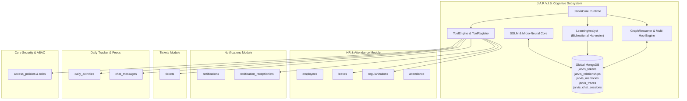

# J.A.R.V.I.S. Cross-Module Dependencies & Interactions

## 1. External Module Interactions

J.A.R.V.I.S. functions as an intelligent orchestrator across Workhub ERP. It reads from and acts upon multiple external domain collections via service hooks and tools:

| External Module | Direction | Collections Touched | What Data is Accessed / Mutated | Risk & Failure Impact |
| :--- | :--- | :--- | :--- | :--- |
| **HRMS / Attendance** | Read & Write | `employees`, `leaves`, `regularizations`, `attendance` | Reads employee profile, manager hierarchy, and leave balances; submits leaves (`hrmsTools.applyLeave`) and executes batch approvals (`notificationTools.batchApprove`). | Inactive employee reference or corrupt leave balance calculation breaks automated approvals. |
| **Notifications** | Read & Write | `notifications`, `notification_receptionists` | Reads unread notifications for AI digest; updates `isRead` and `isClicked` flags upon batch approval. | Missing receiver reference causes notification digest to miss critical pending actions. |
| **Tickets & Support** | Read & Write | `tickets`, `ticket_comments` | Reads tickets to check support workload; assists drafting structured Agile tickets with acceptance criteria (`ticketTools.draftAssist`). | Inaccurate ticket category or client mapping in draft assistant creates orphaned tickets. |
| **Daily Tracker** | Read | `daily_activities` | Scans logged work items, hours, clients, and task types for daily standup summarization (`summarizerTools.generateDailySummary`). | Empty activity log produces generic or unhelpful daily standup summaries. |
| **Feeds & Chat** | Read | `feed_posts`, `feed_comments`, `chat_messages` | Reads message threads for conversational catch-up and summarization (`messageTools.summarizeUnread`). | High volume of chat messages could cause summarizer prompt length overflow if unconstrained. |
| **Core Security & ABAC** | Read | `roles`, `access_policies`, `UserLogin` | Validates caller permissions in `PolicyEngine.js` before permitting transactional tool executions. | Missing policy evaluation allows unauthorized users to trigger system actions (guarded by PolicyEngine). |

---

## 2. Mermaid Cross-Module Interaction Diagram

---

## 3. Reference Integrity & Guardrails

1. **Multi-Tenant Isolation**: While J.A.R.V.I.S. global vocabulary (`jarvis_tokens`) and shared ontology (`jarvis_relationships`) reside in Global MongoDB (`tracker_global`), all domain transactional entities (`leaves`, `regularizations`, `employees`) are executed strictly within the caller's isolated tenant database via `ctx.tenantContext.getModel(...)`.
2. **Deterministic Precedence**: If a relation or rule is learned into `jarvis_relationships` or `jarvis_memories`, subsequent executions bypass external LLMs completely, protecting external API quota and ensuring 100% offline availability.
3. **No Direct Model Mutations**: All transactional executions go through registered tool handlers in `Backend/src/jarvis/tools/` which enforce ABAC verification via `PolicyEngine.js` and standard Mongoose schema lifecycle hooks.
