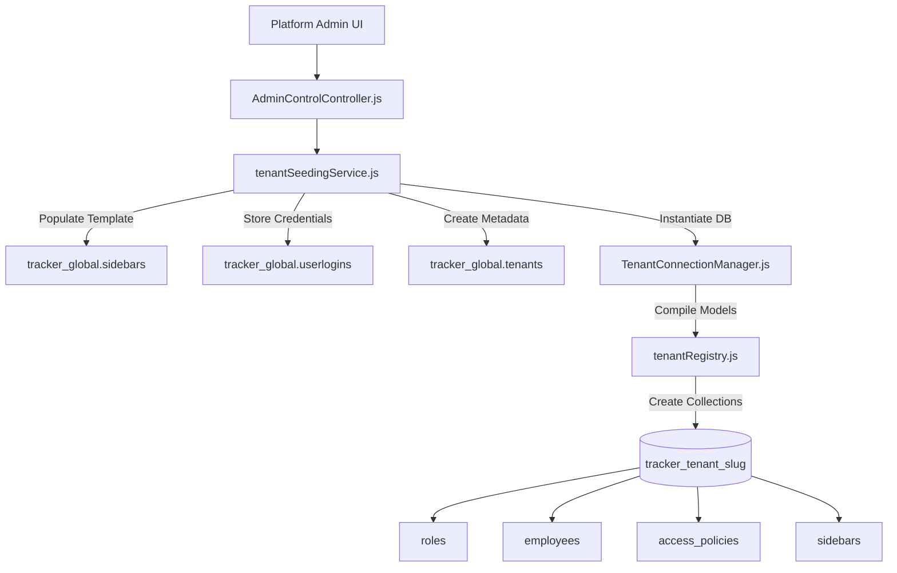

# Tenant Module — Cross-Module Dependency Map

Interactions, MongoDB model references, and component dependencies between Tenant & Platform Admin and external modules.

## 1. External Module Interactions

| External Module | Direction | Collections / Models | Payload / Data Exchanged | Risk & Impact |
|---|---|---|---|---|
| **Auth & Global User** | Read/Write | `tracker_global.userlogins` | `email`, `tenantId`, `password` hash | Password hash mismatch prevents initial tenant login |
| **Core / Sidebars** | Read | `tracker_global.sidebars` | Platform sidebar template copying | Empty global sidebars table results in 0 tenant sidebars |
| **Master Data** | Write | Tenant `departments`, `designations` | Super Admin dept & desig seeding | Default Super Admin designation creation failure |
| **RBAC / Policies** | Write | Tenant `roles`, `access_policies`, `capabilities` | Full Super Admin capability matrix | Policy misconfiguration locks Super Admin out |

---

## 2. System Dependency Diagram

