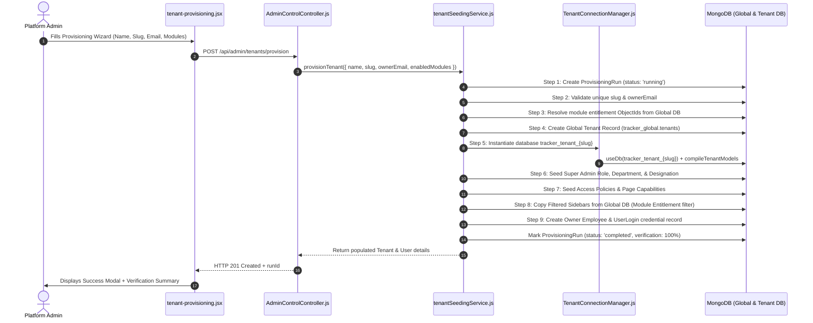

# Tenant Module — Data Flow & Dynamic API Maps

Detailed end-to-end user actions and internal execution data flows for tenant provisioning and management.

## Flow 1: 9-Step Atomic Tenant Provisioning



---

## Flow 2: Multi-Tenant Connection Resolution & Context Propagation

```
Incoming Request (e.g. GET /populate/read/employee)
  │
  ├─► tenantContextMiddleware (tenantContext.js)
  │     ├── Extract X-Tenant-ID header or Subdomain slug
  │     ├── Fetch tenant metadata from tracker_global.tenants
  │     ├── Call TenantConnectionManager.getTenantConnection(dbName, enabledModules)
  │     │     ├── Check RAM LRU connectionCache (Map)
  │     │     │     ├── If Hit: Reuse mongoose.connection.useDb socket pool
  │     │     │     └── If Miss: Compile models via tenantRegistry.js & cache in LRU
  │     │     └── Async non-blocking: runTenantMigrations & ensureTenantIndexes
  │     └── Enter AsyncLocalStorage store: { tenantId, dbName, models, conn }
  │
  └─► Controller / populateHelper.js
        └── Access models via req.tenantContext.models[modelName]
```

---

## Flow 3: Tenant Status & Module Entitlement Update

1. **Platform Admin Action**: Toggles tenant status (e.g. `Active` ➔ `Suspended`) or updates module entitlements in `tenant-management.jsx`.
2. **API Request**: `PUT /api/admin/tenants/:tenantId/status` or `PUT /api/admin/tenants/:tenantId/modules`.
3. **Database Write**: `AdminControlController.js` updates `tracker_global.tenants` document.
4. **Cache Invalidation**: Invokes `TenantConnectionManager.invalidate(tenantId)` to immediately evict the stale cached connection/model mapping from RAM.
5. **Subsequent Request**: Re-compiles model schemas with the new module key permissions on next incoming user payload.
